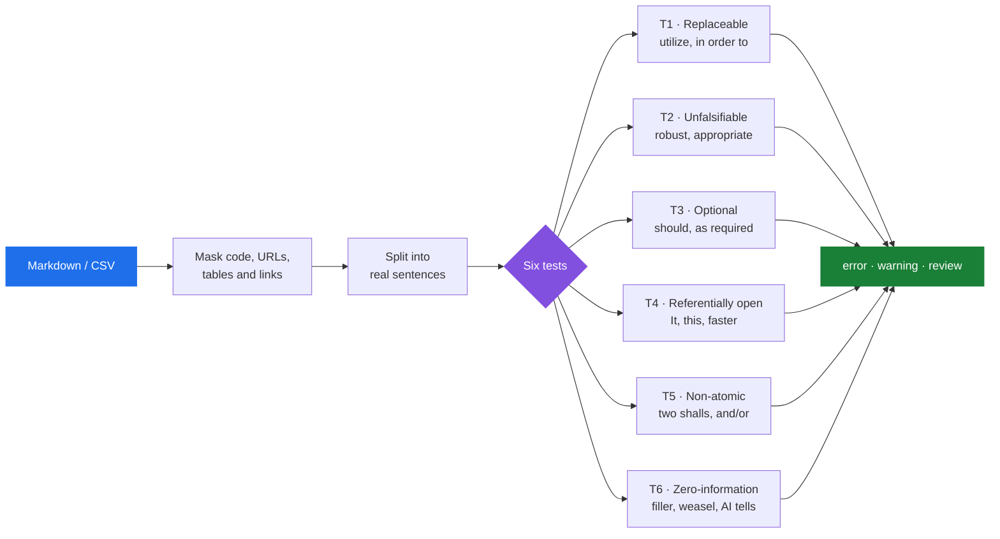

<div align="center">

# STE-Linter

### Catch ambiguity before your readers do.

A writing linter for technical documentation, in the spirit of<br/>
**[ASD-STE100 Simplified Technical English](https://www.asd-ste100.org/)**.

[](https://github.com/Firelight-Innovations/STE-Linter/actions/workflows/ci.yml)
[](https://pypi.org/project/ste100-linter/)
[](https://www.python.org/downloads/)
[](#install)
[](LICENSE)

**[Install](#install)** · **[Quick start](#quick-start)** · **[Rule catalogue](docs/rules.md)** · **[Wiki](https://github.com/Firelight-Innovations/STE-Linter/wiki)**

</div>

---

A spell-checker asks whether a word is a word.
**STE-Linter asks whether a sentence can be misread by someone who has to act on it.**

It reads Markdown and CSV and reports the words and sentence shapes that make technical
writing imprecise. Hedges that let a rule mean anything. References with no antecedent.
Sentences carrying three demands at once. Filler that survives deletion without loss.

**No dependencies. No build step. No network. One command.**

## What it catches

Every finding belongs to one of six tests. Each asks a different question about a sentence.



## See it work

Three sentences of ordinary-looking documentation:

```markdown
# Recovery

The operator should utilize the appropriate procedure to restore the system
as required. It is important to note that the system will handle errors and
the controller shall reset the link and it shall log the event.
```

Every one of the six tests fires. This is the real output, with only the indented source-snippet line under each finding removed for length:

```console
$ ste100 --profile spec guide.md
ste100: 1 files, 9 errors, 4 warnings, 1 review
smell_density=6.5 ari_grade=10.66 passive_ratio=0.0 budget_violations=0
guide.md:3:14 ERROR T3 STE-T3-HDG-0106 -- Optional (hedge): 'should'.
guide.md:3:21 ERROR T1 STE-T1-SUB-0104 -- Replaceable: 'utilize' -> 'use'.
guide.md:3:33 ERROR T1 STE-T1-SUB-0233 -- Replaceable: 'appropriate' -> 'proper'.
guide.md:3:33 WARNING T2 STE-T2-VAG-0015 -- Unfalsifiable: 'appropriate' with no number, unit, or named acceptance condition.
guide.md:4:1 ERROR T3 STE-T3-ESC-0006 -- Optional (escape clause): 'as required'.
guide.md:4:14 ERROR T1 STE-T1-SUB-0328 -- Replaceable: 'It is' -> ''.
guide.md:4:14 WARNING T4 STE-T4-PRO-0008 -- Referentially open: pronoun 'It' with no clear antecedent in this unit.
guide.md:4:14 ERROR T5 STE-T5-MULTI-0001 -- Non-atomic: 2 'shall' imperatives in one sentence.
guide.md:4:14 ERROR T6 STE-T6-AI-0004 -- Zero-information (AI tell, hedging_opener): 'It is important to note that'.
guide.md:4:38 WARNING T4 STE-T4-PRO-0017 -- Referentially open: pronoun 'that' with no clear antecedent in this unit.
guide.md:4:54 ERROR T3 STE-T3-HDG-0143 -- Optional (hedge): 'will'.
guide.md:5:37 ERROR T5 STE-T5-COMB-0001 -- Non-atomic: second combinator 'and' in one sentence (spec profile).
guide.md:5:41 WARNING T4 STE-T4-PRO-0008 -- Referentially open: pronoun 'it' with no clear antecedent in this unit.
```

Every finding carries a file, a line, a column, a stable rule ID, and a reason.
`--explain` tells you where a rule comes from; `--fix` applies the unambiguous ones.

## Three ways to run it

<table>
<tr>
<th width="33%">⌨️ Command line</th>
<th width="33%">🤖 AI agent skill</th>
<th width="33%">🔌 HELVE tool</th>
</tr>
<tr>
<td valign="top">

For humans, editors and CI.

```bash
pipx install ste100-linter
ste100 docs/
```

Exit `0` clean, `1` on error-tier
findings, `2` on tool failure —
so it drops straight into CI.

[CLI Reference →](https://github.com/Firelight-Innovations/STE-Linter/wiki/CLI-Reference)

</td>
<td valign="top">

Lets Claude lint and rewrite prose
before it hands work back.

```bash
mkdir -p ~/.claude/skills
cp -r .claude/skills/ste100-lint \
  ~/.claude/skills/ste100-lint
```

Works in Claude Code and any agent
that reads `SKILL.md`.

[Agent Skill →](https://github.com/Firelight-Innovations/STE-Linter/wiki/Agent-Skill)

</td>
<td valign="top">

Newline-delimited JSON-RPC over
stdio, for tool hosts.

```bash
ste100-helve --helve-rpc
```

Declared by `helve-tool.toml`.
stdout stays protocol-pure.

[Integrations →](https://github.com/Firelight-Innovations/STE-Linter/wiki/Integrations)

</td>
</tr>
</table>

Try it right now, with nothing installed:

```bash
git clone https://github.com/Firelight-Innovations/STE-Linter.git
cd STE-Linter && python ste_lint.py tests/corpus_default/
```

> **Status: beta.** The rules and CLI are stable enough to use daily. Rule IDs are stable from v0.1.0 onward. Read [known limitations](#known-limitations) before you adopt the linter in blocking CI.

Longer guides live in the **[project wiki](https://github.com/Firelight-Innovations/STE-Linter/wiki)** — start with [How the Linter Works](https://github.com/Firelight-Innovations/STE-Linter/wiki/How-the-Linter-Works), the [CLI Reference](https://github.com/Firelight-Innovations/STE-Linter/wiki/CLI-Reference), and [Configuration](https://github.com/Firelight-Innovations/STE-Linter/wiki/Configuration).

---

## Contents

- [Why](#why)
- [Relationship to ASD-STE100](#relationship-to-asd-ste100)
- [Install](#install)
- [Quick start](#quick-start)
- [What it checks](#what-it-checks)
- [Severity and exit codes](#severity-and-exit-codes)
- [Configuration](#configuration)
- [Adopting it on an existing codebase](#adopting-it-on-an-existing-codebase)
- [Integrations](#integrations)
- [Known limitations](#known-limitations)
- [Documentation](#documentation)
- [Contributing](#contributing)
- [License](#license)

---

## Why

Most writing tools optimise for readability scores. This one optimises for **precision** — whether a sentence can be misread by someone who has to act on it.

That distinction matters most in documents where ambiguity has a cost: specifications, runbooks, API references, safety and compliance material. `The system should handle errors as appropriate` scores well on readability and pins down nothing. Four rules fire on it here, across three of the six tests. The hedge `should`. The escape clause `as appropriate`. The replaceable word `appropriate`, and `appropriate` again as an unfalsifiable term with no acceptance condition.

The fixed T4, T5 and structural checks cite the requirements-quality literature they come from, and `--explain` prints the citation:

```console
$ ste100 --explain STE-T5-ANDOR-0001
STE-T5-ANDOR-0001: T5 Non-atomic: 'and/or' is always an error (MIL-STD-961E, NASA SEH).
```

Those citations name the INCOSE requirements guides, the NASA Systems Engineering Handbook, MIL-STD-961E, the EARS templates, and Femmer et al. on requirements smells.

The bulk word tables come from a different lineage, and their attribution is coarser. **Only the T1 substitution table carries a per-entry `source` field.** `--explain` reports it for a T1 rule.

The T2 vague-term, T3 hedge, and T6 filler and AI-tell tables carry their provenance at the table level instead. Each file has a `sources` block naming the upstream project, its URL, copyright holder and licence, and which shipped table it feeds. That is real attribution, though coarser than T1's: it tells you where a table came from, not which upstream contributed an individual word. A prose summary of the same ground is in [docs/rules.md](docs/rules.md).

`--explain` does not yet surface either kind of source for these tests — it prints the raw table entry, which for T2, T3 and T6 is an ID and a pattern. That gap is tracked in [#10](https://github.com/Firelight-Innovations/STE-Linter/issues/10).

Third-party attribution for the upstream word lists is in [NOTICE](NOTICE) and [THIRD-PARTY-LICENSES.md](THIRD-PARTY-LICENSES.md). Both ship in the wheel under `.dist-info/licenses/`.

**This is not a grammar checker and not a style guide.** It will not catch a factual error or an awkward paragraph. It catches a bounded, well-defined set of ambiguity patterns, and stays quiet about everything else.

## Relationship to ASD-STE100

This project is inspired by ASD-STE100 and is not a licensed, certified, or conforming implementation of it. It ships no part of the ASD STE Dictionary and makes no conformance claim. The rule tables are independently assembled from open sources, and a clean run here does not mean a document meets the standard. For the standard itself, see [asd-ste100.org](https://www.asd-ste100.org/) and the wiki page on [Simplified Technical English](https://github.com/Firelight-Innovations/STE-Linter/wiki/Simplified-Technical-English).

## Install

Requires **Python 3.9+**. Nothing else — the linter is standard library only, so no dependency tree to audit and no compilation step.

```bash
# Recommended: an isolated install that puts `ste100` on your PATH
pipx install ste100-linter

# Or with uv
uv tool install ste100-linter

# Or plain pip
pip install ste100-linter
```

Verify:

```bash
ste100 --version
```

> The package is not on PyPI yet. Until the first tagged release publishes, install from a source checkout or with `pip install git+https://github.com/Firelight-Innovations/STE-Linter.git`.

<details>
<summary>Run from a source checkout, without installing</summary>

```bash
git clone https://github.com/Firelight-Innovations/STE-Linter.git
cd STE-Linter
python ste_lint.py --help
```

`ste_lint.py` is a shim that puts `src/` on the path and calls the same entry point, so every example below works with `python ste_lint.py` substituted for `ste100`.
</details>

**Windows:** `ste100` forces UTF-8 on its own output, so suggestions containing non-ASCII print correctly in PowerShell and `cmd` without `-X utf8` or a `chcp` dance.

Platform-by-platform notes: [Installation](https://github.com/Firelight-Innovations/STE-Linter/wiki/Installation).

## Quick start

```bash
ste100                      # lint the current directory tree
ste100 docs/ README.md      # lint specific paths
ste100 --stats docs/        # include advisory review-tier findings
ste100 --format json docs/  # machine-readable output
ste100 --fix docs/          # apply the unambiguous substitutions in place
```

The full flag set is `--format`, `--profile`, `--config`, `--preset`, `--root`, `--fix`, `--explain`, `--baseline`, `--stats`, `--today`, `--version` and `--help`. Read the [CLI Reference](https://github.com/Firelight-Innovations/STE-Linter/wiki/CLI-Reference) for what each one does.

When a finding is unclear, ask:

```console
$ ste100 --explain STE-S7-TBD-0001
STE-S7-TBD-0001: Structural: 'tbd' is an error; use 'TBR' with a best estimate (NASA SEH).
```

How much you get back depends on the family. T4, T5, structural, CSV and budget IDs resolve to a one-line explanation like that one, with the standard it comes from. IDs from the bulk word tables resolve to their raw table entry instead, and **that entry is richest for T1** — pattern, suggestion, `alts` and source:

```console
$ ste100 --explain STE-T1-SUB-0104
STE-T1-SUB-0104: {
  "pattern": "utilize",
  "suggestion": "use",
  "alts": [
    "use"
  ],
  "source": "vale_redhat.simple_words",
  "id": "STE-T1-SUB-0104"
}
```

For a T2, T3 or T6 ID you get the id and the matched pattern, and nothing else. `--explain STE-T3-HDG-0032` reports the pattern `can`, with no suggestion and no source.

### Reading the output

```
requirements.md:5:52 ERROR T3 STE-T3-ESC-0002 -- Optional (escape clause): 'as appropriate'.
    ...handle errors as appropriate.
└── file  ·  line:column  ·  severity  ·  test  ·  rule id  ·  message
```

`--format json` returns the same findings as objects, plus summary metrics (`smell_density`, `ari_grade`, `passive_ratio`, `budget_violations`), which is what you want for dashboards or custom reporting.

## What it checks

Six tests, each targeting a different way a sentence loses precision.

| Test | Name | Catches | Example |
|:--|:--|:--|:--|
| **T1** | Replaceable | A long word where a short one is exact | `utilize` → `use` |
| **T2** | Unfalsifiable | Claims with no test that could fail | `robust`, `seamless`, `user-friendly` |
| **T3** | Optional | Hedges and escape clauses that void the sentence | `may`, `as appropriate`, `if necessary` |
| **T4** | Referentially open | References with no resolvable antecedent | `it`, `this`, `faster` (than what?) |
| **T5** | Non-atomic | One sentence carrying several demands | `and/or`, two `shall`s, four commas |
| **T6** | Zero-information | Text that survives deletion without loss | `actually`, `leverage synergies`, AI tells |

Plus **structural** checks (passive voice, bare numbers with no unit, `TBD`, undefined abbreviations, `must` where `shall` is the mandatory keyword), **budget** checks (sentence, paragraph and whole-file length), and optional **CSV integrity** checks for document-control registries.

The rule tables ship with the package: 424 substitutions, 420 filler and weasel entries, 193 hedge patterns, 84 vague terms, and 11 AI-tell phrases. Every entry carries a stable ID.

Full catalogue with worked before/after rewrites: **[docs/rules.md](docs/rules.md)**.

## Severity and exit codes

| Tier | Meaning | Shown by default | Affects exit code |
|:--|:--|:--:|:--:|
| `error` | A defect worth fixing | yes | **yes** |
| `warning` | Likely a defect; needs judgement | yes | no |
| `review` | Advisory only | no (`--stats`) | no |

| Exit code | Meaning |
|:--|:--|
| `0` | No error-tier findings |
| `1` | One or more error-tier findings |
| `2` | Tool failure (bad config, unreadable file) |

Only `error` breaks a build. Distinguish `1` from `2` in CI — the first means your docs need work, the second means the linter is misconfigured.

## Configuration

No config file is required to start. Read the profile note below first, though. A file's path decides its profile, and its profile decides how strict the run is.

Configuration resolves in this order, first match winning:

1. `--config path/to/file.json`
2. `--preset <name>` — `default` or `veistra`
3. `ste100.json` or `.ste100.json`, found by walking up from the target tree
4. the shipped `default` preset

**Profiles** apply different strictness to different documents. The `default` preset ships five — `spec`, `reference`, `csv`, `docs` and `prose` — selected by path glob, by a `--profile` override, or per file with a first-line comment:

```markdown
<!-- lint-profile: spec -->
```

The `docs` profile is the quiet one, and its path list is a fixed allowlist: `README.md`, `CONTRIBUTING.md`, `SECURITY.md`, `CODE_OF_CONDUCT.md`, `CHANGELOG.md`, their lowercase spellings, and anything under `docs/` or `examples/`. A `requirements.md`, or anything under a `spec/` tree, lands in `spec`, the strict one.

**Every other Markdown file falls through to `prose`, which is stricter than `docs`.** An `ARCHITECTURE.md` or a `guides/setup.md` gets error-tier findings on `can`, `will`, `should` and a causal `so` — ordinary correct English. Pass `--profile docs` for those runs, or commit a project-local `ste100.json`. See [known limitations](#known-limitations) for the detail and the fix.

Full key reference and profile semantics: **[docs/configuration.md](docs/configuration.md)** and the wiki's [Configuration](https://github.com/Firelight-Innovations/STE-Linter/wiki/Configuration) page.

## Adopting it on an existing codebase

Running a new linter over years of documentation produces an unusable wall of findings. Use a baseline: record what exists today, then enforce only on new writing.

```bash
ste100 --format json docs/ > .ste100-baseline.json   # snapshot today's findings
ste100 --baseline .ste100-baseline.json docs/        # only new findings surface
```

The snapshot run exits 1 whenever it finds anything, so do not chain it with `&&` or run it under `set -e`.

Commit the baseline. Shrink it deliberately over time rather than all at once. Suppression counts occurrences rather than matching line numbers, so a second `utilize` added to a file that already had one still surfaces.

## Integrations

<details>
<summary><b>Claude Code skill</b></summary>

This repo ships a skill at `.claude/skills/ste100-lint/`. It teaches the model to run the linter and to *rewrite* prose in response to each test family. It also teaches the model when a finding is a false positive to be scoped rather than obeyed. See the wiki's [Agent Skill](https://github.com/Firelight-Innovations/STE-Linter/wiki/Agent-Skill) page.
</details>

<details>
<summary><b>pre-commit</b></summary>

```yaml
repos:
  - repo: https://github.com/Firelight-Innovations/STE-Linter
    rev: v0.1.0
    hooks:
      - id: ste100-lint
```

`rev` needs a tag that exists; no release is tagged yet, so pin a commit SHA until v0.1.0 ships. A second hook, `ste100-lint-fix`, applies the unambiguous T1 substitutions on commit. That hook is opt-in.
</details>

<details>
<summary><b>GitHub Actions</b></summary>

```yaml
- uses: actions/setup-python@v5
  with:
    python-version: "3.x"
- run: pip install ste100-linter
- run: ste100 docs/
```
</details>

<details>
<summary><b>HELVE-ADE</b></summary>

Installable as a HELVE Tool through `helve-tool.toml`, speaking JSON-RPC 2.0 over stdio. The `ste100-helve` console script runs the same server by hand. See **[docs/helve.md](docs/helve.md)**.
</details>

<details>
<summary><b>VS Code</b></summary>

`examples/vscode/tasks.json` includes a `problemMatcher` that maps findings into the Problems panel.
</details>

More, with copy-pasteable configs: **[docs/integrations.md](docs/integrations.md)**, [examples/](examples/), and the wiki's [Integrations](https://github.com/Firelight-Innovations/STE-Linter/wiki/Integrations) page.

## Known limitations

Stated plainly, because a linter that oversells itself gets uninstalled.

- **The analysis is lexical, not semantic.** Rules match words and sentence shapes. The linter cannot tell a hedge that matters from one that does not, so some findings need your judgement. That is why the `warning` and `review` tiers exist — do not treat every finding as a defect.
- **The out-of-box tuning covers named paths only, and this is the sharp edge.** The rule tables were calibrated on specification writing, where a bare `should` or `may` really is a defect. The `default` preset softens that for ordinary documentation: hedge words, open-ended clauses and the whole T6 family drop to `review` tier. That softening applies inside the `docs` profile only, whose paths are the fixed allowlist named under [Configuration](#configuration). Every other Markdown file falls through to `prose`, where those buckets are still error tier.

  The same prose lints two ways. `You can run the tool. It will read the file, so check permissions. You should retry.` is clean in a `README.md` or under `docs/`. As `ARCHITECTURE.md`, `INSTALL.md` or `guides/setup.md` it reports four errors: `can`, `will`, `should`, and a causal `so`. A repo that keeps its documentation anywhere else gets those on the first run.

  Two workarounds, both verified. Pass `--profile docs` to force the quiet profile for a run:

  ```bash
  ste100 --profile docs ARCHITECTURE.md
  ```

  Or commit a project-local `ste100.json` that copies the shipped preset and widens the `docs` profile's `path_globs` to include `*.md` and `**/*.md`. The linter finds that file by walking up from the target, so `ste100` then needs no flags. [docs/configuration.md](docs/configuration.md) has the key reference.

- **Even on the quiet path, quieter is not quiet.** Linting this repository's own 25 Markdown files reports 157 error-tier findings, and 115 of them are T1 replaceable-word substitutions. T1 stays at error tier in every profile on purpose: its advice is usually right on ordinary prose. Expect to disagree with some of it, and expect a baseline to be the practical way in.
- **`--fix` is deliberately narrow.** It applies only T1 substitutions with exactly one unambiguous replacement, never deletes text, and skips whole lines that contain code spans or links. Everything else is reported for a human.
- **CSV integrity checks target a specific schema.** The `STE-CSV-*` rules check a document-control registry (`truths.csv`, `decisions-*.csv`, `terminology.csv`). They are off in the `default` preset.
- **Some config keys are parsed but never read**, including `severity_defaults`, `thresholds` and the per-profile `ari_target`. [docs/configuration.md](docs/configuration.md) marks which keys the engine reads.
- **The rule-data generator is not runnable.** `devtools/build_lint_data.py` needs a source wordlist that is not in this repo. The JSON tables under `src/ste100/data/` are the source of truth; edit them directly. See [CONTRIBUTING.md](CONTRIBUTING.md).

## Documentation

| Document | Contents |
|:--|:--|
| [Wiki](https://github.com/Firelight-Innovations/STE-Linter/wiki) | Guides: the standard, how the linter works, install, CLI, config, integrations |
| [docs/rules.md](docs/rules.md) | Every rule, its rationale and before/after examples |
| [docs/configuration.md](docs/configuration.md) | Config keys, profiles, severity resolution |
| [docs/integrations.md](docs/integrations.md) | CLI, CI, editors, pre-commit, baselines |
| [docs/helve.md](docs/helve.md) | HELVE-ADE tool integration |
| [CONTRIBUTING.md](CONTRIBUTING.md) | Setup, tests, proposing a rule |
| [SECURITY.md](SECURITY.md) | Reporting a vulnerability |
| [CHANGELOG.md](CHANGELOG.md) | Release history |

## Contributing

Contributions are welcome — above all **false-positive reports**, which are the most useful signal for a linter. A dedicated issue template captures the sentence, the rule, and the profile.

```bash
git clone https://github.com/Firelight-Innovations/STE-Linter.git
cd STE-Linter
for t in tests/run_*.py; do python -X utf8 "$t" || break; done
```

Eight suites run today: corpus behaviour, suggestion safety, `--fix`, `--baseline`, config handling, the default preset's out-of-box quietness, the HELVE JSON-RPC server, and adversarial input against the performance budget. No install or virtualenv needed to run any of them.

Read [CONTRIBUTING.md](CONTRIBUTING.md) for how the rule data is structured and how rule IDs are assigned.

## License

[Apache-2.0](LICENSE). Copyright 2026 Firelight Innovations.
